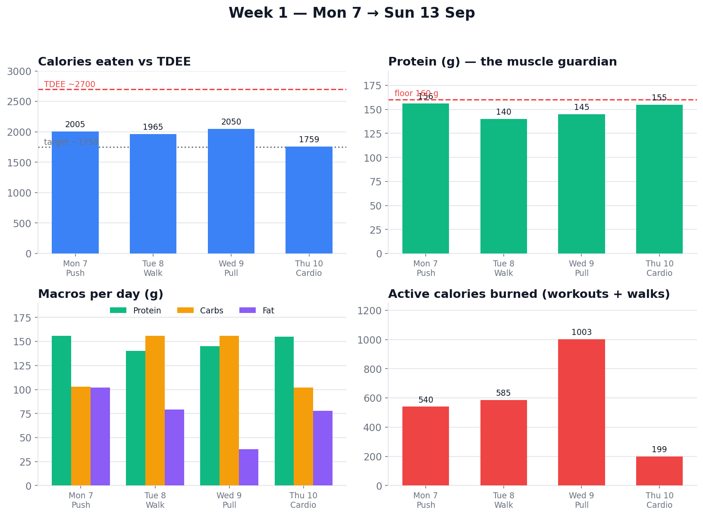

# Week 1 Summary — Mon 7 → Thu 10 Sep

_(4 of 5 training days done; Legs Fri + weekend pending. Regenerate: `python3 charts/make_week.py 1`. Data: [`../charts/data/week-01.json`](../charts/data/week-01.json).)_

## InBody: Expected vs Actual
_(Expected computed Sun night from the week's deficit; Actual from Mon 14 scan. Chart `week-01-inbody.png` auto-generates once both are in.)_

| Metric | Baseline (7 Sep) | **Expected** (Sun prediction) | **Actual** (Mon 14 scan) | Hit? |
|--------|------------------|-------------------------------|--------------------------|------|
| Weight (kg) | 98.8 | _TBD_ | _TBD_ | |
| Muscle SMM (kg) | 38.2 | hold ~38.2 | _TBD_ | |
| Fat mass (kg) | 32.2 | _TBD_ | _TBD_ | |
| Body fat % | 32.6 | _TBD_ | _TBD_ | |
| Visceral | 15 | _TBD_ | _TBD_ | |

## Daily numbers
| Day | Training | kcal | Protein | Carbs | Fat | Est. deficit* | Notes |
|-----|----------|------|---------|-------|-----|---------------|-------|
| Mon 7 | Push | 2,005 | 156 | 103 | 102 | ~695 | baseline InBody (98.8 kg) |
| Tue 8 | Walk / cardio | 1,965 | 140 | 156 | 79 | ~735 | client misal (higher carb) |
| Wed 9 | Pull | 2,050 | 145 | 156 | 38 | ~650† | 3 sessions; night out (2½ LIITs) |
| Thu 10 | Cardio / recovery | 1,759 | 155 | 102 | 78 | ~940 | best-executed food day |
| **Avg** | | **1,945** | **149** | **128** | **74** | **~755/day** | |

\* deficit = fixed TDEE 2,700 − intake. † Wed's real burn was far higher (3-session day) → real deficit ~1,500–2,500.

## What went well ✅
- **Every single day in a deficit** — the fundamental is locked. Avg ~755/day (more on Wed).
- **Protein averaged ~149 g** — just under the 160 floor, strong muscle protection. Whey front-loading saved the night-out day.
- **Trained on schedule** — Push, Pull, and cardio all done; only 3 Pull exercises skipped (crowded rack).
- **Big activity base** — daily walks + workouts, peaking at ~1,000 active kcal Wed.

## Watch-outs ⚠️
- **Carbs drifted off low-carb twice** — Tue misal + Wed drinks pushed carbs to 156 g. Intentional/social, not a habit yet.
- **Fat spikes** from full-fat paneer (Mon 102 g, Thu 78 g) — low-fat paneer is the easy fix.
- **Wed night out** (2½ LIITs) → fragmented 6 h 3 m sleep. One-off, but alcohol clearly dented recovery (elevated sleeping HR).
- **Sleep only tracked 1 night** — get the watch on nightly.

## The real verdict
Numbers look great, but **Monday's InBody scan is the judge.** 4 deficit days with protein held is exactly the recipe to lose fat and keep the 38 kg SMM. If the scan confirms it, we lock the TDEE and push into Week 2 progression.
